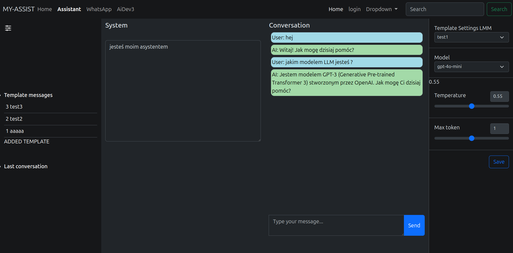

# Assistant AI

## Description
The project aims to create an assistant capable of performing various tasks, such as automatically responding to messages from messengers like WhatsApp, generating images, and analyzing documents/images.

Currently, the application includes a simple dashboard at [/assistant], allowing interaction with OpenAI models. It provides features such as adjusting settings, selecting models, saving conversations, and managing prompt templates.

The code for completing the AI-devs_3 course can be found in ./src/Command/AiDevs3Tasks.
## Screenshot

### Assistant page

## Requirements
    To run this application, you need to have the following installed:

    PHP (recommended version: 8.2 or higher)
    Composer
    Symfony cli - or use docker  
    Node.js / NPM (to bulid assets)
    mysql (optional-docker)

## Installation Process

### Clone the repository:

    git clone https://github.com/JanMadon/AssistantAI

### Navigate to the project directory:

    cd AssistantAI

### Install PHP dependencies using Composer:
    composer install

### Copy the .env.example file to .env
    cp .env.example .env

### Install JavaScript dependencies using NPM:
    npm install

### Compile JavaScript and CSS assets:
    npm run build
    or
    npm run dev

### Connect with your db or use:
    docker-compose up

### Start symfony dev serwer (optional):
    symfony server:start

The application will be accessible at http://localhost:8000.

## License

The Laravel framework is open-sourced software licensed under the [MIT license](https://opensource.org/licenses/MIT).
